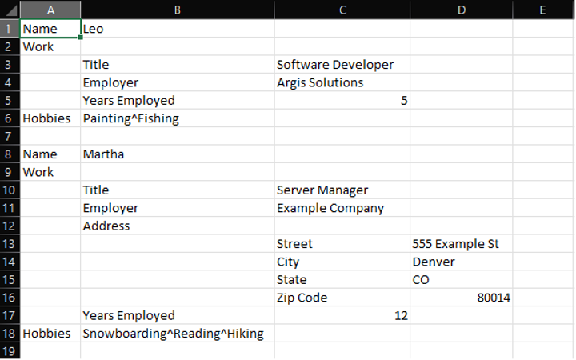

# CSV to JSON Converter

Built by Joshua Steele, 2021-12-22.

## Rationale

This CLI program converts a CSV file to a JSON file, displaying the contents of each file.

I built the program in **Java** because it is the programming language that I have the most experience with. It's also the only programming language that we covered the basics of File I/O in during my software development boot camp at Tech Elevator.

As for user experience, in the interests of time, I went with a simple and straightforward **Command Line Interface**. While we did learn some File I/O in Java, we did not cover how to create a GUI in Java. 

After completing a CLI version of this program, I did begin to research how to build a GUI in Java using Java Swing. However, I was unable to make enough progress on a GUI before my submission deadline.

If I had more time, adding a GUI to this program would be the next thing I did to improve it.

## How to Run the program

### First, create a properly formatted CSV file.



- Objects should be separated by a blank line (lines 7 and 19)
- Each name/value pair should be one of the following:
    - A name in one column with its value in the next column (lines 1, 3, 4, 5, 8, etc.)
    - A name in one column followed by a blank cell (lines 2 and 9). This means the value is the object that starts in
      the next row, which will be indented
    - A name in one column with an array in the next column, separated by carats (lines 6 and 18)
- Nested objects should be one column to the right from their value (lines 3-5, 10-12 and 13-16)
- Nested objects should end when the next name/value pair is to the left of the nested object

### Then, download and run this Java application.

- Clone this repository to your local machine.
- Open the repository and run Application.java.
- When prompted, enter the file path for the CSV file you'd like to convert to JSON.
- You will be shown the contents of your CSV file, followed by the contents of your new JSON file, as well as the file path to the new file.

## Example

The output JSON for the above example should look similar to the following:

```json
[
  {
    "Name": "Leo",
    "Work": {
      "Title": "Software Developer",
      "Employer": "Argis Solutions",
      "Years Employed": 5
    },
    "Hobbies": ["Painting", "Fishing"]
  },
  {
    "Name": "Martha",
    "Work": {
      "Title": "Server Manager",
      "Employer": "Example Company",
      "Address": {
        "Street": "555 Example St",
        "City": "Denver",
        "State": "CO",
        "Zip Code": 80014
      },
      "Years Employed": 12
    },
    "Hobbies": ["Snowboarding", "Reading", "Hiking"]
  }
]
```

